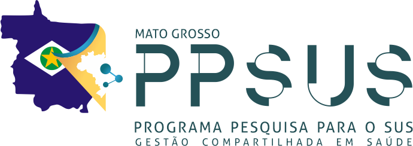
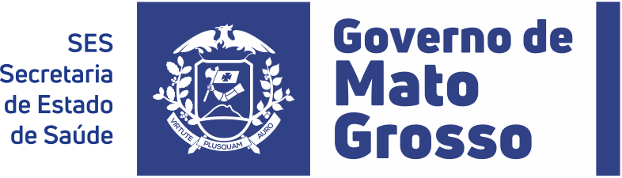

## O projeto

O projeto **Gestão integrada no SUS: avaliação da eficiência na oferta e previsão da demanda de serviços públicos de saúde em seus diferentes níveis de atenção nos municípios de Mato Grosso** foi aprovado no Edital PPSUS 004/2025 da FAPEMAT (Programa Pesquisa para o SUS: gestão compartilhada em saúde), processo FAPEMAT-PRO.0001999/2025, com orçamento de R$ 199.655,00 e vigência de 27/11/2025 a 26/11/2027. É executado pela Universidade do Estado de Mato Grosso (UNEMAT), Campus de Sinop, em parceria com a Secretaria de Estado de Saúde (SES-MT).

A pergunta central é simples de enunciar e difícil de responder: **com os recursos que tem, cada município de Mato Grosso está produzindo o quanto poderia em cada nível de atenção — e quanta demanda deve esperar nos próximos anos?** Para respondê-la, o projeto organiza os dados públicos do SUS em um repositório único, mede a eficiência com Análise Envoltória de Dados (DEA), acompanha a produtividade ao longo do tempo com o índice de Malmquist e constrói modelos de previsão de demanda.

## Objetivos

1. Construir um repositório integrado (Data Lake) com os dados do SUS para os 142 municípios de Mato Grosso, 2020–2025.
2. Medir a eficiência técnica com DEA em quatro camadas: os municípios na atenção básica e na média complexidade, as regiões de saúde na alta complexidade e os hospitais SUS por estabelecimento.
3. Acompanhar a evolução da produtividade entre 2020 e 2025 com o índice de Malmquist, separando ganhos de eficiência de mudanças na tecnologia.
4. Prever a demanda por serviços de saúde por município e nível de atenção com modelos estatísticos e de aprendizado de máquina.
5. Devolver os resultados aos gestores em um aplicativo web (este site é o primeiro passo) e em artigos e relatórios.

## Produtos previstos

| Produto | Conteúdo | Situação |
|---|---|---|
| P1 · Data Lake do SUS-MT | Bases do SIOPS, CNES, SIA, SIH, SISAB, SI-PNI, SIM, SINASC e IBGE, tratadas e integradas | Em uso: alimenta a versão 0.1 deste site |
| P2 · Escores de eficiência (DEA) | Municípios × níveis de atenção, 2020–2025 | Em preparação |
| P3 · Índice de Malmquist | Variação da produtividade 2020–2025 | Em preparação |
| P4 · Previsão de demanda | Modelos por município e nível de atenção | Previsto |
| P5 · Aplicativo web | Este observatório, ampliado com os escores e as previsões | Versão 0.1 publicada |
| P6 · Artigos e relatórios | Publicações científicas e relatórios técnicos | Previsto |

## Recorte

Os **142 municípios** de Mato Grosso (Boa Esperança do Norte foi instalado em 2025 e entra nas tabelas a partir desse ano), organizados em **16 regiões de saúde** (as CIR) e **6 macrorregiões**, conforme o Plano Diretor de Regionalização. A janela analítica é **2020–2025**: é o período em que todas as fontes coincidem com qualidade aceitável (ver [Metodologia](metodologia.qmd)).

## Equipe

- **Coordenação:** Prof. Lindomar Pegorini Daniel (UNEMAT, Campus de Sinop)
- Udilmar Zabot (UNEMAT)
- Felipe Vazquez (UNEMAT)
- Luceni Grassi (SES-MT)
- Vitor Benfica (ciência de dados)
- Paulo Freitas Filho (UFMT)
- Feliciano Azuaga
- Marcos Oliveira (software)
- Felisberto Edgar Gomes (bolsista de iniciação científica)

## Cronograma resumido

| Marco | Situação |
|---|---|
| Vigência do projeto: 27/11/2025 a 26/11/2027 | Em andamento |
| Versão 0.1 do observatório: dados e indicadores 2020–2025 e análise de deslocamento | Publicada em 30/09/2026 |
| Escores de eficiência (DEA) e índice de Malmquist | Em preparação (próximas versões) |
| Modelos de previsão de demanda; ampliação do aplicativo | Previsto |
| Artigos, relatórios e devolutiva aos gestores | Previsto |

As etapas seguem o plano de trabalho aprovado; o site é atualizado a cada etapa concluída.

## Realização e financiamento

O projeto é executado pela UNEMAT — Universidade do Estado de Mato Grosso, Campus de Sinop, e financiado pelo Programa Pesquisa para o SUS: gestão compartilhada em saúde (PPSUS) — Edital FAPEMAT nº 004/2025, processo FAPEMAT-PRO.0001999/2025 — com recursos da FAPEMAT, do CNPq, do Decit/SECTICS/Ministério da Saúde e da SES-MT.

**Realização**

::: {.logos-realizacao}
[ ]{.rodape-rotulo} 
:::

**Financiamento**

::: {.logos-realizacao}
     
:::

[As logomarcas são usadas em cumprimento à cláusula 7ª, §3º, do Termo de Concessão (referência obrigatória ao apoio da FAPEMAT, do CNPq e do Decit/SECTICS/MS em toda divulgação); a origem de cada arquivo está documentada em `assets/logos/FONTES.md` no código-fonte.]{.nota-fonte}

## Sobre este site

Este site é atualizado a cada etapa concluída do projeto. A versão 0.1 publica os dados e indicadores de 2020–2025 e a análise de deslocamento entre residência e atendimento nas internações. Os escores de eficiência e de produtividade e as previsões de demanda entrarão nas versões seguintes.

- Só são publicados agregados por município, região de saúde ou estabelecimento (hospitais identificados por nome fantasia e código CNES, dado público). Nenhum microdado é divulgado.
- O site é gerado com [Quarto](https://quarto.org) e R a partir dos painéis do Data Lake do projeto e publicado no GitHub Pages. O código-fonte está em [github.com/daniellindomar/ppsus](https://github.com/daniellindomar/ppsus).
- Encontrou um erro ou tem uma sugestão? Use o link "Criar uma issue" no menu do GitHub ou escreva à coordenação.

**Contato:** lindomar.pegorini@unemat.br

**Como citar:** DANIEL, L. P. et al. *Observatório PPSUS-MT: dados, indicadores e eficiência do SUS nos municípios de Mato Grosso*. Versão 0.1. Sinop: UNEMAT, 2026. Disponível em: https://daniellindomar.github.io/ppsus/. Projeto PPSUS 004/2025 FAPEMAT.

Conteúdo, indicadores e arquivos derivados sob licença [CC BY 4.0](https://creativecommons.org/licenses/by/4.0/deed.pt-br): uso livre com citação do projeto. Os dados de origem são públicos (DATASUS, SIOPS, IBGE).
